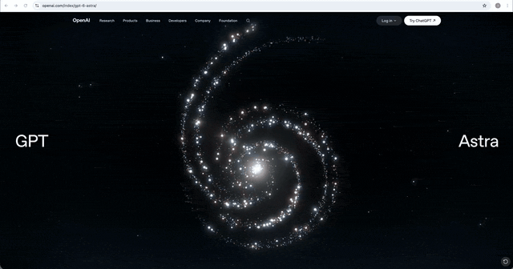
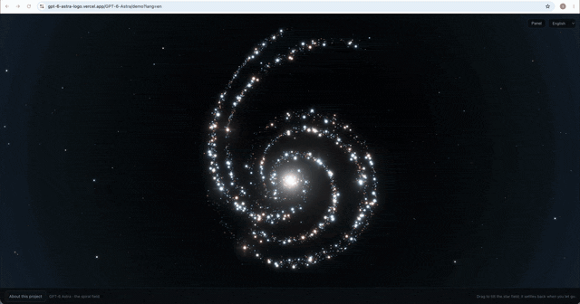

# GPT-6 Astra —— あの星空を数学として組み直す

[English](README.md) · [简体中文](README.zh-Hans.md) · **日本語**

OpenAI の [GPT-6 Astra 発表ページ](https://openai.com/index/gpt-6-astra/)のヒーロー
アニメーションをオープンソースで再構築したものです。5 本のベジェ曲線、中心へ流れる
約 4,600 個の星、そして一度散らばってから形に収束していく空。

公開ページ: <https://gpt-6-astra-logo.vercel.app/>

## オリジナルと再構成

| [OpenAI の発表ページ](https://openai.com/index/gpt-6-astra/) | [このプロジェクトの再構成](https://gpt-6-astra-logo.vercel.app/) |
|---|---|
|  |  |

## クイックスタート

Python 3 が必要です。

```bash
./start.sh     # http://localhost:3021/ で起動
```

## ディレクトリ

| パス | 中身 |
|------|------|
| `code/web/` | サイト本体 |
| `code/shared/i18n/` | 6 言語の文言テーブル |
| `code/tests/` | テスト |
| `docs/media/` | 上の 2 本の GIF |

## デプロイ

Vercel、ルートディレクトリは `code/web`。
